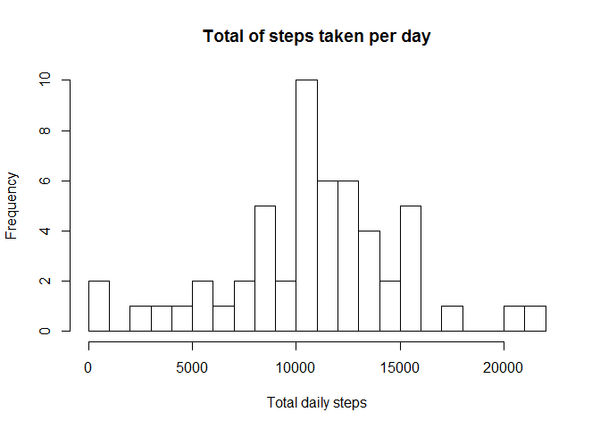
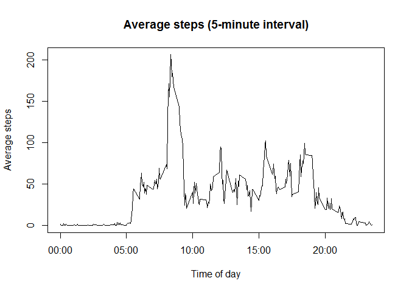
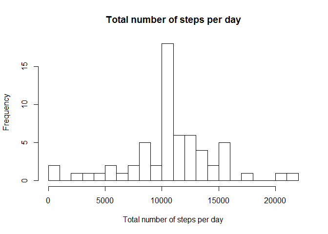
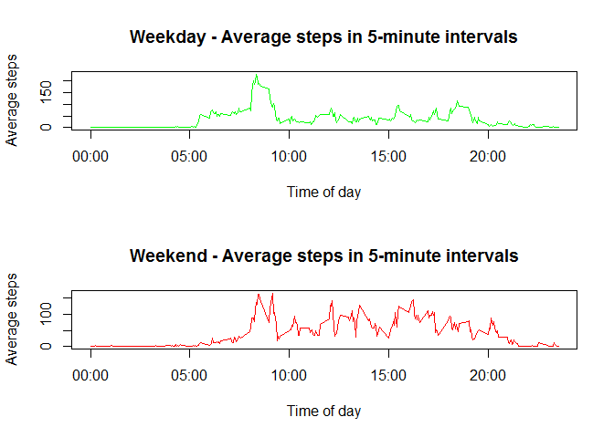

# Reproducible Research: Peer Assessment 1


## Loading and preprocessing the data
Show any code that is needed to

1) Load the data (i.e. read.csv())

2) Process/transform the data (if necessary) into a format suitable for your analysis


```r
setwd("C:\\Users\\Christian\\Documents\\Coursera\\RepResearch\\RepData_PeerAssessment1")
data <- read.csv(unz("activity.zip", "activity.csv"))
```


## What is the mean total number of steps taken per day?
For this part of the assignment, you can ignore the missing values in the dataset.

Make a histogram of the total number of steps taken each day


```r
hist(tapply(data$steps, data$date, sum), xlab = "Total daily steps", breaks = 20, 
    main = "Total of steps taken per day")
```

 


Calculate and report the mean and median total number of steps taken per day

```r
dailySteps <- as.numeric(tapply(data$steps, data$date, sum))
stepMean <- mean(dailySteps, na.rm = TRUE)
stepMedian <- median(dailySteps, na.rm = TRUE)
```

Mean of total number of steps taken per day:

```r
stepMean
```

```
## [1] 10766.19
```

Median of total number of steps taken per day:

```r
stepMedian
```

```
## [1] 10765
```

## What is the average daily activity pattern?
Make a time series plot (i.e. type = "l") of the 5-minute interval (x-axis) and the average number of steps taken, averaged across all days (y-axis)
Which 5-minute interval, on average across all the days in the dataset, contains the maximum number of steps?


```r
data$interval <- as.factor(as.character(data$interval))
intervalMean <- as.numeric(tapply(data$steps, data$interval, mean, na.rm = TRUE))
intervals <- data.frame(intervals = as.numeric(levels(data$interval)), intervalMean)
intervals <- intervals[order(intervals$intervals), ]

labels <- c("00:00", "05:00", "10:00", "15:00", "20:00")
labelsAt <- seq(0, 2000, 500)
plot(intervals$intervals, intervals$intervalMean, type = "l", main = "Average steps (5-minute interval)", 
    ylab = "Average steps", xlab = "Time of day", xaxt = "n")
axis(side = 1, at = labelsAt, labels = labels)
```

 

```r
sortedIntervals <- intervals[order(intervals$intervalMean, decreasing = TRUE), ]
head(sortedIntervals)
```

```
##     intervals intervalMean
## 272       835     206.1698
## 273       840     195.9245
## 275       850     183.3962
## 274       845     179.5660
## 271       830     177.3019
## 269       820     171.1509
```


```r
maxInterval <- sortedIntervals$intervals[1[1]]
maxInterval
```

```
## [1] 835
```


## Imputing missing values
Note that there are a number of days/intervals where there are missing values (coded as NA). The presence of missing days may introduce bias into some calculations or summaries of the data.


Calculate and report the total number of missing values in the dataset (i.e. the total number of rows with NAs)


Devise a strategy for filling in all of the missing values in the dataset. The strategy does not need to be sophisticated. For example, you could use the mean/median for that day, or the mean for that 5-minute interval, etc.


Create a new dataset that is equal to the original dataset but with the missing data filled in.


Make a histogram of the total number of steps taken each day and Calculate and report the mean and median total number of steps taken per day. Do these values differ from the estimates from the first part of the assignment? What is the impact of imputing missing data on the estimates of the total daily number of steps?


```r
dim(data[is.na(data$steps), ])[1]
```

```
## [1] 2304
```

```r
steps <- vector()
for (i in 1:dim(data)[1]) {
    if (is.na(data$steps[i])) {
        steps <- c(steps, intervals$intervalMean[intervals$intervals == data$interval[i]])
    } else {
        steps <- c(steps, data$steps[i])
    }
}
```


```r
cleanedData <- data.frame(steps = steps, date = data$date, interval = data$interval)
    
hist(tapply(cleanedData$steps, cleanedData$date, sum), xlab = "Total number of steps per day", breaks = 20, main = "Total number of steps per day")
```

 

```r
stepsDaily <- as.numeric(tapply(cleanedData$steps, cleanedData$date, sum))
meanOfSteps <- mean(stepsDaily)
medianOfSteps <- median(stepsDaily)
```


```r
meanOfSteps
```

```
## [1] 10766.19
```


```r
medianOfSteps
```

```
## [1] 10766.19
```

Comparison of Mean and Median:

Original Data: 
mean 10765 and median 10766.16

Imputed Data: 
mean 10766 and median 10766

The original data set contained a number of days filled with NAs.These were showing up in the lowest bracket. By including the imputed values (based on the average values) the resulting analysis is more representative, because the imputed values remove some of the skew.


## Are there differences in activity patterns between weekdays and weekends?

For this part the weekdays() function may be of some help here. Use the dataset with the filled-in missing values for this part.


Create a new factor variable in the dataset with two levels - "weekday" and "weekend" indicating whether a given date is a weekday or weekend day.


Make a panel plot containing a time series plot (i.e. type = "l") of the 5-minute interval (x-axis) and the average number of steps taken, averaged across all weekday days or weekend days (y-axis). See the README file in the GitHub repository to see an example of what this plot should look like using simulated data.


```r
cleanedData$dayType <- c("weekend", "weekday", "weekday", 
    "weekday", "weekday", "weekday", "weekend")[as.POSIXlt(cleanedData$date)$wday + 1]
cleanedData$dayType <- as.factor(cleanedData$dayType)

weekday <- cleanedData[cleanedData$dayType == "weekday", ]
weekend <- cleanedData[cleanedData$dayType == "weekend", ]
meansAtWeekday <- as.numeric(tapply(weekday$steps, weekday$interval, mean))
meansAtWeekend <- as.numeric(tapply(weekend$steps, weekend$interval, mean))

intervalsDayType <- data.frame(intervals = as.numeric(levels(data$interval)), meansAtWeekday, meansAtWeekend)
intervalsDayType <- intervalsDayType[order(intervalsDayType$intervals), ]
```


Plot two time series - weekdays and weekends - of the 5-minute intervals and average number of steps taken.


```r
par <- par(mfrow = c(2, 1))
plot(intervalsDayType$intervals, intervalsDayType$meansAtWeekday, type = "l", 
    col = "green", ylab = "Average steps", xlab = "Time of day", main = "Weekday - Average steps in 5-minute intervals", xaxt = "n")
axis(side = 1, at = labelsAt, labels = labels)
plot(intervalsDayType$intervals, intervalsDayType$meansAtWeekend, type = "l", 
    col = "red", ylab = "Average steps", xlab = "Time of day", main = "Weekend - Average steps in 5-minute intervals", xaxt = "n")
axis(side = 1, at = labelsAt, labels = labels)
```

 


